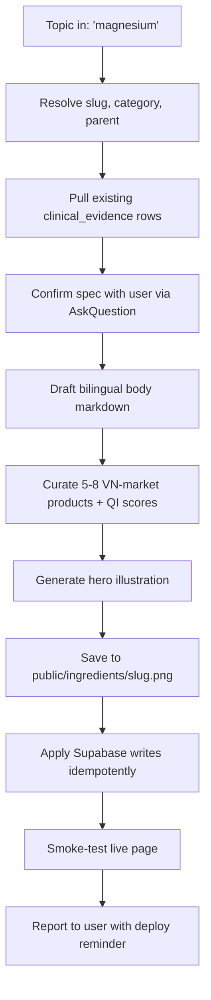

# add-ingredient

Turn a topic name into a deploy-ready ingredient page in one pass.

## When to invoke

Trigger on any of:

- "Add a new ingredient X"
- "Create an ingredient page for X"
- "Document supplement compound X"
- "Add vitamin D / magnesium / omega-3 / etc. to NutriAI"
- "Tạo trang hoạt chất X" / "Thêm ingredient X"

Do NOT invoke for:

- Updating an existing ingredient's body content (that's a focused edit, not a fresh authoring).
- Adding a single supplement product (use a direct SQL insert).
- Migrating schema (use a migration file directly).

## Workflow



## Inputs

Required:

- **Topic / desired slug** — kebab-case English (`magnesium`, `vitamin-d`, `omega-3`). If user gave a Vietnamese name, translate to canonical English slug first.

Optional (skill prompts only when relevant):

- **Parent slug** — set when the topic is a derivative (`creatine-hcl` → parent `creatine`).
- **Category override** — when the default category guess is wrong.
- **Pre-authored body** — user pastes Vietnamese markdown; skill skips the drafting step and uses it verbatim.
- **Custom illustration brief** — when the topic doesn't fit the default "scoop of powder" aesthetic (e.g. soft-gel for omega-3, capsule for vitamins).

## Procedure

### Step 1 — Resolve the topic

Decide:

- **`slug`**: kebab-case English. Singular. Strip "the", "a". Examples: `vitamin-d`, `magnesium-glycinate`, `omega-3`, `coenzyme-q10`.
- **`category`** from the enum (validated against [lib/i18n/categories.ts](../../../lib/i18n/categories.ts)):
  - `vitamin` — A, B-complex, C, D, E, K
  - `mineral` — Mg, Zn, Ca, Fe, Se, etc.
  - `amino acid` — creatine, BCAA, glutamine, lysine, etc.
  - `fat` — omega-3, MCT, CLA, GLA
  - `protein` — whey, casein, collagen, plant proteins
  - `fiber` — psyllium, inulin, glucomannan
  - `other` — herbs, adaptogens (ashwagandha, turmeric), CoQ10, melatonin, probiotics
- **`name_en`** and **`name_vn`** — proper nouns, no marketing fluff. Vietnamese commonly keeps the English chemical name (e.g. "Creatine", "Magnesium") with optional Vietnamese descriptor in body. When in doubt, use the English name for both.
- **`parent_ingredient_id`** — non-null only when the topic is a salt / form / derivative of an existing molecule. Examples:
  - `vitamin-d3` parent → `vitamin-d`
  - `magnesium-glycinate` parent → `magnesium`
  - `creatine-hcl` parent → `creatine`
  - `epa` and `dha` parent → `omega-3`
- **`typical_dose_min`**, **`typical_dose_max`**, **`typical_unit`** — evidence-based daily range. Examples: vitamin D `1000–4000 IU`, magnesium `200–400 mg`, creatine `3–5 g`, omega-3 `1–3 g`.

### Step 2 — Pull existing evidence

Before drafting, query Supabase to see what we already cite for this ingredient:

```sql
SELECT count(*) AS evidence_count
FROM public.clinical_evidence ce
JOIN public.ingredients i ON i.id = ce.ingredient_id
WHERE i.slug = '{slug}';
```

If `count > 0`, the body should reference these studies (the page surfaces them in the Evidence section, so claims should align).

### Step 3 — Confirm with the user

Surface the resolved spec in a single `AskQuestion` so the user can correct course before any writes:

- Slug
- Category
- Parent (if any)
- Dose range
- Number of existing evidence rows found
- Whether the user wants to provide their own body text or have the skill draft one

Bail (or branch to manual mode) if the user objects.

### Step 4 — Draft the bilingual body

Use the [body template](#body-template) below. Vietnamese is primary. Sections are H2; sub-claims under "Công dụng" are H3. Keep paragraphs evidence-driven; avoid marketing language. Cite mechanism + study findings in plain language; do not invent specific study citations — the page links to actual `clinical_evidence` rows separately.

If the user pre-authored the body, skip drafting and use their input verbatim.

### Step 5 — Curate VN-market products

Pick 5 to 8 products containing this ingredient that are realistically available on Vietnamese marketplaces (Tiki, Shopee, GymStore, Lazada). Prefer brands the local audience recognizes:

- **General supplements**: Now Foods, Pure Encapsulations, Thorne, Jarrow Formulas, Doctor's Best, Solgar
- **Sports**: Optimum Nutrition, MuscleTech, Universal, Cellucor, BulkSupplements, Beast Sports, ProMera
- **Vitamins/minerals specifically**: Nature Made, Nature's Bounty, Garden of Life, Kirkland Signature
- **Premium**: Thorne, Designs for Health, Klaire Labs

For each product capture:

- `slug`: prefix with `vn-` to distinguish from DSLD-ingested rows. Example: `vn-now-magnesium-glycinate-180vc`
- `name_en`, `name_vn` — bilingual product name (often identical, since brand names don't translate)
- `brand`, `form`, `net_quantity`, `description_en/vn`, `source_url`, `price_vnd`
- `dose` and `unit` for the `supplement_ingredients` link
- **`affiliate_url`** — the Shopee VN listing URL the user will buy from. Required on every `vn-*` row. See [Affiliate URL handling](#affiliate-url-handling) below.
- **`affiliate_platform`** — `'shopee'` for now. Free-text column; future Tiki/Lazada additions don't need a migration.

Score each on the [Quality Index rubric](#quality-index-rubric) below.

### Affiliate URL handling

The `vn-` prefix is the contract: a `vn-*` slug means **VN-marketplace
product with an affiliate URL required**. Without `affiliate_url`, the
"Mua trên Shopee" CTA disappears from both the ranked card and the
detail page — the row is functionally invisible commercially.

Default to a **Shopee VN search URL** built from `name_en`:

```
'https://shopee.vn/search?keyword=' || replace(lower(name_en), ' ', '%20')
```

This is a deterministic placeholder that lands the user on Shopee's
results page for the brand + product. It never rots when individual
sellers churn. If you can spend the time to click through and pick a
specific seller's listing, swap the search URL for the canonical
`https://shopee.vn/{vanity}-i.{shop_id}.{item_id}` URL and update the
[`docs/affiliate/shopee-todo.csv`](../../../docs/affiliate/shopee-todo.csv)
canonical column.

Post Shopee Affiliate program approval, every `affiliate_url` is
swapped to a tracked variant via a single UPDATE — see
[`docs/affiliate/README.md`](../../../docs/affiliate/README.md) for
the lifecycle.

Editorial integrity guard: **never** let the prospect of higher
commission influence Quality Index scoring. The rubric below stays
independent of affiliate revenue.

### Step 6 — Generate the hero illustration

Use `GenerateImage` with the [illustration prompt template](#illustration-prompt-template). The prompt is parameterized:

- Subject form depends on the ingredient (powder scoop for amino acids/protein; soft-gel capsule for fish oil/vitamin D/E; capsule for vitamins/minerals; oil bottle for MCT/omega-3)
- Watermark molecule = the actual skeletal formula of the ingredient
- Brand palette is locked

Save the result to `public/ingredients/<slug>.png`. The `GenerateImage` tool writes the asset to a project-managed location; copy/move it into `public/ingredients/` so `next/image` can serve it.

### Step 7 — Apply Supabase writes (idempotent, in this order)

Use the Supabase MCP `execute_sql` tool. All writes use `ON CONFLICT DO UPDATE` so re-runs are safe.

1. **Upsert `ingredients` row** (with `parent_ingredient_id` if applicable):

   ```sql
   INSERT INTO public.ingredients (
     slug, name_en, name_vn, category, description_en, description_vn,
     safety_notes_en, safety_notes_vn,
     typical_dose_min, typical_dose_max, typical_unit,
     parent_ingredient_id
   ) VALUES (
     '{slug}', '{name_en}', '{name_vn}', '{category}',
     '{desc_en}', '{desc_vn}',
     {safety_en_or_NULL}, {safety_vn_or_NULL},
     {dose_min}, {dose_max}, '{dose_unit}',
     {parent_id_or_NULL}
   )
   ON CONFLICT (slug) DO UPDATE SET
     name_vn = excluded.name_vn,
     description_en = excluded.description_en,
     description_vn = excluded.description_vn,
     safety_notes_en = excluded.safety_notes_en,
     safety_notes_vn = excluded.safety_notes_vn,
     typical_dose_min = excluded.typical_dose_min,
     typical_dose_max = excluded.typical_dose_max,
     typical_unit = excluded.typical_unit,
     parent_ingredient_id = excluded.parent_ingredient_id
   RETURNING id;
   ```

2. **Upsert `ingredient_pages` row**:

   ```sql
   INSERT INTO public.ingredient_pages (ingredient_id, body_vn, body_en, kol, image_url)
   SELECT id, $body_vn$...$body_vn$, $body_en$...$body_en$, 'NutriAI Editorial', '/ingredients/{slug}.png'
   FROM public.ingredients WHERE slug = '{slug}'
   ON CONFLICT (ingredient_id) DO UPDATE SET
     body_vn = excluded.body_vn,
     body_en = excluded.body_en,
     kol = excluded.kol,
     image_url = excluded.image_url;
   ```

   Use `$body_vn$ ... $body_vn$` dollar-quoted strings to avoid escape-hell with markdown bodies.

3. **Upsert `supplements`** (one INSERT per product, all `ON CONFLICT (slug) DO UPDATE`). Required columns: `slug`, `name_en`, `name_vn`, `brand`, `form`, `net_quantity`, `description_en/vn`, `source_url`, `price_vnd`, **`affiliate_url`**, **`affiliate_platform = 'shopee'`**. The two affiliate columns can default to the deterministic search URL described in [Affiliate URL handling](#affiliate-url-handling) above.

4. **Wipe + reinsert `supplement_ingredients` links** (cleaner than upsert because it removes stale links if a re-run shrinks the product set):

   ```sql
   DELETE FROM public.supplement_ingredients
   WHERE supplement_id IN (
     SELECT id FROM public.supplements WHERE slug LIKE 'vn-{slug}-%' OR slug IN (...)
   );

   INSERT INTO public.supplement_ingredients (supplement_id, ingredient_id, dose, unit)
   SELECT s.id, i.id, {dose}, '{unit}'
   FROM public.supplements s, public.ingredients i
   WHERE i.slug = '{ingredient_slug}'
     AND s.slug IN ('vn-...', 'vn-...');
   ```

   IMPORTANT: never use the `LIKE 'vn-%-creatine%' OR ... AND ...` pattern that bit me on the first creatine seed (operator-precedence bug created cartesian products). Always list slugs explicitly with `IN (...)`.

5. **Upsert `quality_index`** — omit `tier`, the `default_tier` BEFORE-INSERT trigger from migration 0003 fills it from `total_score`:

   ```sql
   INSERT INTO public.quality_index (supplement_id, lab_test_score, ingredient_quality_score, price_per_dose_score, notes)
   SELECT id, {lab}, {ing}, {price}, '{notes}'
   FROM public.supplements WHERE slug = '{vn_slug}'
   ON CONFLICT (supplement_id) DO UPDATE SET
     lab_test_score = excluded.lab_test_score,
     ingredient_quality_score = excluded.ingredient_quality_score,
     price_per_dose_score = excluded.price_per_dose_score,
     notes = excluded.notes;
   ```

### Step 8 — Verify

Boot a local prod build and curl the resulting page. Mirror the verification we did for Creatine:

```bash
# Boot prod local on a free port
cd /path/to/NutriAI
PORT=3030 npm run start &> /tmp/log.txt &
disown

# Wait until ready
for i in 1 2 3 4 5; do sleep 2; curl -sf -o /dev/null "http://localhost:3030/vi" && break; done

# Smoke test the new page
curl -sf -o /tmp/p.html "http://localhost:3030/vi/ingredients/{slug}"
grep -c "{ingredient_name}" /tmp/p.html       # body and hero text present
grep -c "Sản phẩm chứa" /tmp/p.html           # products section heading present
grep -c "/vi/supplements/vn-{slug}-" /tmp/p.html  # at least one product card linked

# Image asset
curl -s -o /dev/null -w "%{http_code}\n" "http://localhost:3030/ingredients/{slug}.png"

# Tear down
pkill -9 -f next-server
```

Report results back to the user with:

- Page URL (`/vi/ingredients/{slug}`)
- Number of products curated + tier breakdown (e.g. "1 S, 4 A, 2 B")
- Whether the illustration generated successfully
- Reminder: skill does NOT commit or deploy. User runs `git commit` + `vercel deploy --prod --yes` themselves, or asks the parent agent to.

## Body template

Vietnamese-primary. Replace `{X}` placeholders. Sections must use H2 (`##`) and H3 (`###`) — the page's `prose-styled` CSS in [app/globals.css](../../../app/globals.css) targets these levels. Keep paragraph length to 2–4 sentences for mobile readability.

```markdown
## {X} là gì?

{2–3 paragraphs introducing the molecule: what it is biochemically, where it comes from in the body / diet, why people supplement it. Plain-language; cite mechanism without citing specific studies.}

## Công dụng

{One-paragraph intro citing NIH / authoritative source in plain text — "Nghiên cứu được công bố trên Thư viện Y học Quốc gia (NIH) cho thấy..."}

### {Benefit 1 title}
{2–3 sentences with a specific quantitative claim if available.}

### {Benefit 2 title}
{Same structure.}

### {Benefit 3 title}
{Same structure.}

### {Benefit 4 title — optional}

## Liều dùng

{1 paragraph context.}

- **{Phase / scenario 1}**: {dose + frequency + duration}
- **{Phase / scenario 2}**: {dose + frequency}
- **Cách sử dụng tối ưu**: {timing, food, hydration, etc.}

## Tác dụng phụ

{1 paragraph framing — generally safe with caveats.}

- {Side effect 1}
- {Side effect 2}
- ... (5–10 bullets typical)

{Closing paragraph: when to consult a doctor, contraindications.}

## Phân loại / Các dạng phổ biến

{One-line intro.}

- **{Form 1 (e.g. Magnesium glycinate)}**: {bioavailability + use case + evidence note}
- **{Form 2}**: {same structure}
- **{Form 3}**: {same structure}
- ... (3–6 forms)

## Câu hỏi thường gặp

### {Common question 1?}
{1–2 sentence answer.}

### {Common question 2?}
{1–2 sentence answer.}

### {Common question 3?}
{1–2 sentence answer.}

---

{1-paragraph closing summary — value of the ingredient + safety reminder.}
```

English body mirrors the same H2/H3 structure with equivalent content. If LLM bandwidth is tight or the topic is well-served by VN content alone, leave `body_en` NULL — the page falls back to VN gracefully via `pickLocale`.

## Quality Index rubric

Apply the same rubric across ingredients so cross-page comparisons are meaningful. Tier auto-fills via the `default_tier` BEFORE-INSERT trigger (S ≥85, A ≥70, B ≥55, C otherwise).

### `lab_test_score` (0–40)

| Score | Signal |
|---|---|
| 36–40 | NSF Certified for Sport |
| 28–35 | Informed-Sport tested |
| 22–27 | USP-grade or equivalent pharmacopoeia certification |
| 18–22 | Reputable brand (Now, Jarrow, Doctor's Best) without third-party cert |
| 12–17 | Mid-tier brand, no testing claims |
| 5–11 | Budget brand or unverified labels |

### `ingredient_quality_score` (0–30)

| Score | Signal |
|---|---|
| 25–30 | Purest evidence-backed form (e.g. creatine monohydrate, magnesium glycinate, methyl-cobalamin B12) |
| 20–24 | Standard well-studied form |
| 14–19 | Novel form with thinner evidence (creatine HCl, kre-alkalyn) |
| 8–13 | Multi-blend that dilutes the active dose, or a less-bioavailable form (e.g. magnesium oxide) |

### `price_per_dose_score` (0–30)

| Score | Signal |
|---|---|
| 25–30 | Cheapest in class (BulkSupplements bulk powder, Costco-brand) |
| 18–24 | Mid-tier (Now, Jarrow, mainstream sports brands) |
| 10–17 | Premium (Thorne, Pure Encapsulations) |
| 5–10 | Ultra-premium / boutique |

Each score must come with a `notes` string explaining the rationale (1–2 sentences, surfaced as the small-text under the rank card on the page).

## Illustration prompt template

Pass this to `GenerateImage` with the parameterized fields filled in. The brand palette and composition rules are locked across ingredients so the gallery stays cohesive.

```
A modern flat-illustration hero image for an ingredient page about {X}, in a friendly consumer-health-app aesthetic.

Subject (foreground, sharp): {form-specific scene — pick one}
- Powder ingredients: A clean white plastic supplement tub tipped slightly on its side with a stainless-steel scoop spilling a soft mound of {X} powder onto a flat surface. A few small powder grains scatter near the scoop.
- Capsule ingredients: A clean white pill bottle tipped on its side with 4-6 capsules ({color}) spilling out onto a flat surface, label-side hidden.
- Soft-gel ingredients: A cluster of 5-7 amber soft-gel capsules arranged loosely on a flat surface, one slightly elevated. No bottle.
- Liquid / oil ingredients: A small clear glass dropper bottle, half full of golden-amber {X} oil, with the dropper resting beside it. A single drop suspended below the dropper tip.

Background (faint watermark, low contrast, ~15% opacity): The skeletal structural formula of {X} — the actual molecule — drawn in thin clean lines, large and centered, partly behind the foreground subject.

Accent: A few small soft glowing dots and one minimalist {motif} icon floating near the subject, suggesting {benefit motif: lightning bolt for energy / leaf for adaptogen / heart for cardiovascular / brain for cognition / shield for immunity}. Very subtle.

Style: Modern flat vector illustration with soft gradients, clean geometric shapes, gentle soft shadows. NOT a photograph, NOT 3D rendered. Stripe / Linear / Notion illustration aesthetic — minimal, friendly, professional.

Color palette (strict): primary soft sage green (#A7D8B8 / #C8E6CD), cream off-white background (#F8FAF7), warm peach accent (#FFD4B8) used very sparingly only on the motif icon and a couple of glowing dots. Steel/glass in light gray. Watermark molecule in a slightly darker sage outline.

No text, no labels, no logos, no human figures, no muscles, no gym equipment.

Composition: square 1:1 aspect ratio. Subject centered slightly left-of-center, room around all sides for breathing space. Watermark molecule fills most of the canvas behind everything.

Mood: clean, evidence-based, approachable, warm but not playful.
```

After generation, copy / move the asset to `public/ingredients/{slug}.png`. The route renders the image via `next/image` with `priority` + responsive `sizes`, so the source can be a 1024–2048px PNG; Next will auto-serve WebP/AVIF on demand.

## Idempotency patterns

The skill is designed for safe re-runs:

- **Ingredient row**: `ON CONFLICT (slug) DO UPDATE` — re-running with refined names/descriptions overwrites cleanly.
- **Page row**: `ON CONFLICT (ingredient_id) DO UPDATE` — body refresh is non-destructive aside from the body itself; `published_at` is preserved on re-update because we don't include it in the SET clause.
- **Supplement rows**: `ON CONFLICT (slug)` — same pattern.
- **Links**: `DELETE ... WHERE supplement_id IN (...)` then re-INSERT. Cleaner than upsert because a re-run with a smaller product set correctly removes obsolete links.
- **Quality Index rows**: `ON CONFLICT (supplement_id)` — omit `tier` so the trigger fills it.

If the user re-runs the skill on an existing ingredient:

1. Confirm with `AskQuestion` that they want to overwrite the existing body — destructive operation.
2. Skip image regeneration unless explicitly requested (asset already exists).
3. Add new products to the existing curation rather than wholesale replacing it (read existing supplements before re-curating).

## Failure modes

| Failure | Recovery |
|---|---|
| `GenerateImage` returns an error or unusable image | Save the page without an image. Route's `imageUrl ? ...` check renders a single-column hero gracefully. Note in the user-facing summary so they know to fill it in later. |
| LLM has thin / no knowledge of the ingredient | Ask the user before drafting; do not invent claims. Offer to skip body authoring and create a stub page (just ingredient row + image) for them to fill in. |
| Slug collision with an existing ingredient | Confirm with user via `AskQuestion` before upserting. The page upsert is destructive to existing body content. |
| Supabase MCP returns an error | Retry once. If still failing, surface the error AND the prepared SQL block in the response so the user can apply it manually via the SQL editor. |
| Migration not applied (e.g. `parent_ingredient_id` column missing) | Check `pg_attribute` for the column before referencing it; if missing, surface a "run migration X first" message and bail. |
| Image filename conflict (an asset exists at `public/ingredients/{slug}.png`) | Default to overwriting; prompt user only if `--keep-existing` was hinted in their request. |

## Verification checklist

Before declaring done, confirm:

- [ ] `ingredients` row exists with non-NULL `name_vn`, `name_en`, `category`, `description_*`.
- [ ] `ingredient_pages` row exists with `body_vn` populated and `image_url` set.
- [ ] `public/ingredients/{slug}.png` exists and is ≥10KB and ≤2MB.
- [ ] At least 3 (ideally 5–8) `supplements` rows linked via `supplement_ingredients` to the new ingredient.
- [ ] Each linked supplement has a `quality_index` row with all three subscores filled and a non-empty `notes`.
- [ ] Local prod server returns HTTP 200 for `/vi/ingredients/{slug}` and `/en/ingredients/{slug}`.
- [ ] Hero text + body + product cards render in the local response.
- [ ] If derivative: parent breadcrumb badge ("Một dạng của X") appears in hero.
- [ ] If parent of a derivative: variants section ("Các dạng khác") lists the children.
- [ ] Search: `/vi/search?q={ingredient_name}` returns the new ingredient as a top-level hit (only if `parent_ingredient_id IS NULL`).

## Reference files

Source-of-truth schema + page rendering. Read these on demand if any procedure step is unclear.

- [supabase/migrations/0003_knowledge_hub.sql](../../../supabase/migrations/0003_knowledge_hub.sql) — `ingredients`, `supplements`, `supplement_ingredients`, `quality_index` schema + tier trigger
- [supabase/migrations/0009_ingredient_pages.sql](../../../supabase/migrations/0009_ingredient_pages.sql) — page body table
- [supabase/migrations/0010_ingredient_pages_image.sql](../../../supabase/migrations/0010_ingredient_pages_image.sql) — `image_url` column
- [supabase/migrations/0011_ingredient_parents.sql](../../../supabase/migrations/0011_ingredient_parents.sql) — `parent_ingredient_id` for derivatives
- [app/[locale]/ingredients/[slug]/page.tsx](../../../app/[locale]/ingredients/[slug]/page.tsx) — what the page expects to read; useful when you suspect a regression
- [lib/knowledge/search.ts](../../../lib/knowledge/search.ts) — `getIngredientPageBySlug`, `listSupplementsByIngredientId`, `listEvidenceByIngredient`, `listIngredientVariants`
- [public/ingredients/creatine.png](../../../public/ingredients/creatine.png) — exemplar illustration to match the visual language

## Out of scope

- **Web research / browsing.** The skill operates from existing `clinical_evidence` rows + general LLM knowledge. If knowledge is thin, escalate to the user — do not invent.
- **Embedding backfill.** `ingredients.embedding` and `ingredient_pages.embedding` columns are nullable. Backfill later via [scripts/seed-knowledge.mts](../../../scripts/seed-knowledge.mts) when AI billing is wired up.
- **Auto-commit / auto-deploy.** Skill stops after writes + smoke-test. Orchestrating agent commits + deploys as a separate step.
- **English body translation when VN is sufficient.** Leave `body_en` NULL when the topic is well-served by VN content alone; `pickLocale` falls back gracefully.

## Demo invocation

User says: "add magnesium"

Skill responds:

1. Resolves slug=`magnesium`, category=`mineral`, no parent, dose=`200–400 mg`.
2. Pulls evidence count (likely 0 unless a PubMed ingest run picked it up).
3. Confirms spec via `AskQuestion`.
4. Drafts VN body covering: what it is, role in 300+ enzymatic reactions, deficiency symptoms, sleep / muscle / cardiovascular benefits, dose by form, side effects, common forms (glycinate / citrate / oxide / threonate), FAQ.
5. Curates 6 products: Now Magnesium Glycinate 180vc, Doctor's Best High-Absorption 240ct, Pure Encapsulations Magnesium Glycinate, Thorne Magnesium Bisglycinate, Jarrow Mag-200, BulkSupplements Magnesium Citrate.
6. Generates illustration with capsule scene + Mg molecule watermark + leaf accent.
7. Applies all writes.
8. Reports: "Magnesium page live at /vi/ingredients/magnesium. 6 products ranked: 1 S, 3 A, 2 B. Run `git add && commit && vercel deploy --prod` to ship."
